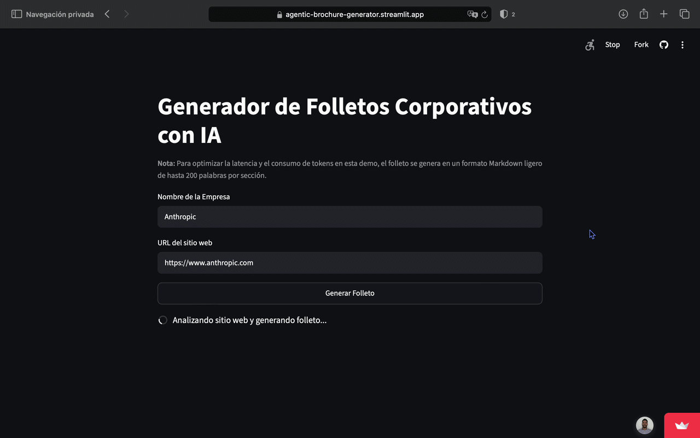

# Generador Agéntico de Folletos Corporativos

[Ver App en Vivo](https://agentic-brochure-generator.streamlit.app/)

Este proyecto de **IA generativa** implementa un flujo de **IA agéntica** diseñado para automatizar la creación de material comercial mediante **web scraping**. La aplicación analiza de forma autónoma la estructura HTML de sitios web corporativos para extraer su propuesta de valor, sintetizar la información clave y crear folletos personalizados mediante llamadas a la **API de OpenAI**.

---

## Demostración de la APP

<p align="center">
  
</p>


---

## Estructura del repositorio

```text
agentic-brochure-generator/
│
├── .github/workflows/
│   └── keep_alive.yml       # Github Actions para mantener la app activa
│
├── media/                     
│   └── demo.gif             # GIF de demostración de la app
│
├── .gitignore               # Exclusión de archivos sensibles y temporales
├── agent.py                 # Flujo agéntico (llamadas a OpenAI)
├── app.py                   # Interfaz gráfica en Streamlit
├── scraper.py               # Módulo de Web Scraping y limpieza de HTML
└── requirements.txt         # Dependencias del proyecto
